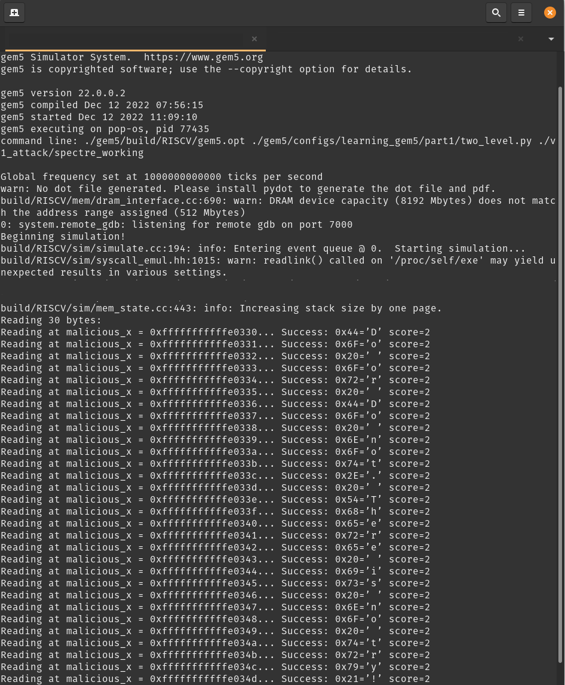
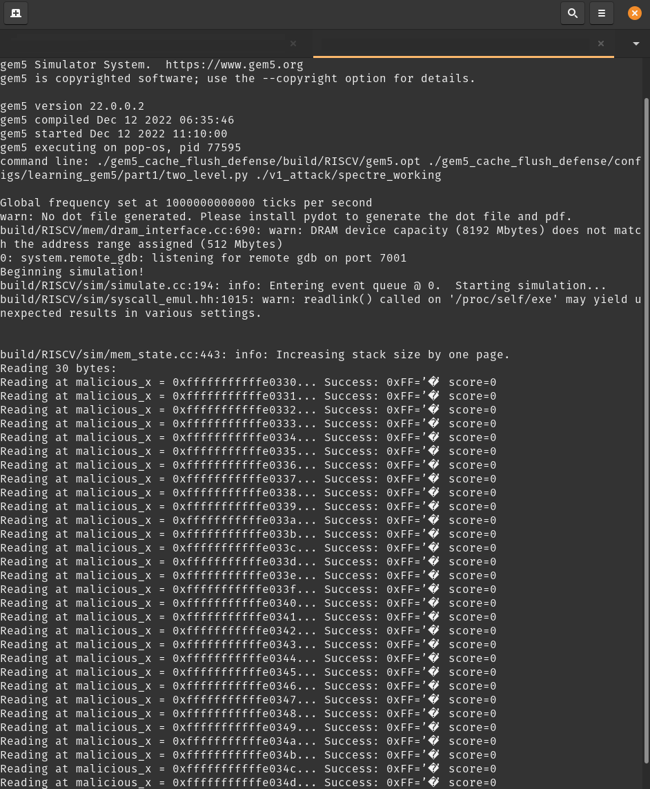

# Getting started with Spectre v1 attack and baseline defense on RISC-V
**Total completion time**:  15 minutes

In this tutorial you will recreate Spectre v1 attack on RISC-V and run a baseline Cache Flush defense

## Table of Contents

* [Prerequisites](#prerequisites)
* [Cloning the Repo](#cloning-the-repo)
* [Install gem5 dependencies](#install-gem5-dependencies)
* [Build Unmodified gem5 Executable](#build-unmodified-gem5-executable)
* [Build gem5 Executable with Cache Flush defense](#build-gem5-executable-with-cache-flush-defense)
* [Build RISC-V Cross Compiler](#build-risc-v-cross-compiler)
* [Compile Spectre v1 attack code](#compile-spectre-v1-attack-code)
* [Run Spectre v1 attack on unmodified RISC-V OoO core](#run-spectre-v1-attack-on-unmodified-risc-v-ooo-core)
* [Run Spectre v1 attack on RISC-V OoO core with Cache Flush defense](#run-spectre-v1-attack-on-risc-v-ooo-core-with-cache-flush-defense)

## Prerequisites

* Python 3.6 or higher
* PC or virtual machine running Ubuntu 20.04 or higher
* Root access

## Cloning the Repo
Clone the following repo to download all sample code

To clone the repo, run the following command:

```shell
git clone https://github.com/sumukhmarathe/RISCV-Spectre-Attack-and-Defense.git
```

## Install gem5 dependencies
Run the following command to install gem5 dependencies

```shell
sudo apt install build-essential git m4 scons zlib1g zlib1g-dev \
    libprotobuf-dev protobuf-compiler libprotoc-dev libgoogle-perftools-dev \
    python3-dev python libboost-all-dev pkg-config
```

## Build Unmodified gem5 Executable
From the root of this repository, run the following command to build gem5 executable

```shell
cd gem5
scons build/RISCV/gem5.opt -j$(nproc)
```

## Build gem5 Executable with Cache Flush defense
From the root of this repository, run the following command to build gem5 executable which enables cache flush defense

```shell
cd gem5_cache_flush_defense
scons build/RISCV/gem5.opt -j$(nproc)
```

## Build RISC-V Cross Compiler
Run the following commands to clone and install RISC-V Cross Compiler

```shell
sudo apt-get install -y autoconf automake autotools-dev curl python3 libmpc-dev libmpfr-dev libgmp-dev gawk build-essential bison flex texinfo gperf libtool patchutils bc zlib1g-dev libexpat-dev
```

Clone the source code of the compiler
```shell
git clone https://github.com/riscv/riscv-gnu-toolchain
cd riscv-gnu-toolchain
```

Configure the build folder where binaries of the compiler would reside
```shell
./configure --prefix=/opt/riscv
```

Build the toolchain and export the PATH
```shell
sudo make linux -j$(nproc)
export PATH=$PATH:/opt/riscv/bin/
```

## Compile Spectre v1 attack code
Run the following commands from root of this repository to compile Spectre v1 attack code

```shell
cd v1_attack
riscv64-unknown-linux-gnu-gcc spectre_working.c -o spectre_working  -static
```
> Note: There might be an error at this step as the compiler binary naming can differ from system to system, follow these steps to get binary name:
> * Run the following commands
> * ``` cd /opt/riscv/bin ```
> * ``` find | grep '^./riscv64-unknown.*gcc$' ```
> * Use the filename of the binary found in the above step instead of riscv64-unknown-linux-gnu-gcc

### Run Spectre v1 attack on unmodified RISC-V OoO core
Run the following commands from root of this repository to run Spectre v1 attack on unmodified gem5

```shell
./gem5/build/RISCV/gem5.opt ./gem5/configs/learning_gem5/part1/two_level.py ./v1_attack/spectre_working
```
You should see the following output which shows that the secret key "Do or do not. There is no try!" is extracted via the side-channel attack


### Run Spectre v1 attack on RISC-V OoO core with Cache Flush defense
Run the following commands from root of this repository to run Spectre v1 attack on a RISC-V core with Cache Flush defense

```shell
./gem5_cache_flush_defense/build/RISCV/gem5.opt ./gem5_cache_flush_defense/configs/learning_gem5/part1/two_level.py ./v1_attack/spectre_working
```

You should see the following output which shows that the attack was defended successfully


